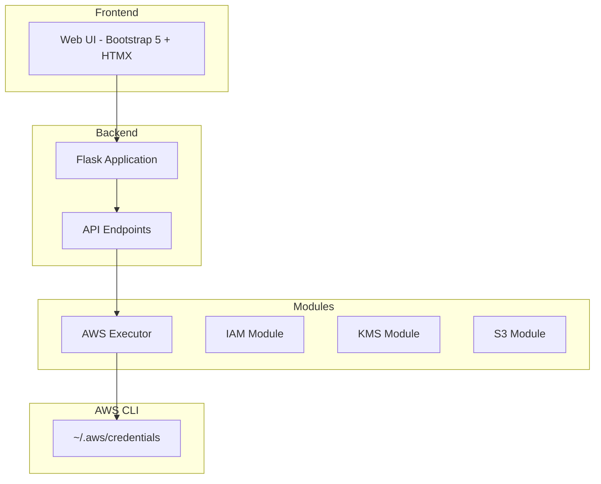

# IAMReaper - Documentation

## Project Overview

IAMReaper is a web application for enumerating and pentesting AWS resources. It uses the AWS CLI configured on the system and provides a modern web interface to execute commands and view results.

## Architecture



---

## Components

### 1. Backend Application

#### [`app.py`](app.py)
Flask application entry point. Contains all API endpoints and web routes.

> **Documentation:** See [docs/app.md](docs/app.md) for detailed API reference.

**Key Functions:**
- [`get_aws_executor()`](app.py:20) - Creates AWS executor with region from session
- [`get_current_results()`](app.py:26) - Retrieves current session results
- [`save_results()`](app.py:39) - Saves results to session store

**API Endpoints:**
| Endpoint | Methods | Description |
|----------|---------|-------------|
| `/` | GET | Main dashboard page |
| `/api/modules` | GET | List available modules |
| `/api/modules/<module_name>/run` | POST, GET | Execute a module |
| `/api/modules/<module_name>/check/<check_name>` | POST | Execute specific check |
| `/api/results` | GET | Get current results |
| `/api/results/<module_name>` | GET | Get module-specific results |
| `/api/command/<int:command_index>` | GET | Get command detail |
| `/api/clear` | POST | Clear results |
| `/api/export/<module_name>` | GET | Export results as JSON |
| `/api/region` | GET, POST | Get/set AWS region |
| `/api/health` | GET | Health check |
| `/api/test` | GET, POST | Test endpoint |

---

### 2. AWS Executor Module

#### [`modules/executor.py`](modules/executor.py)
Executes AWS CLI commands with comprehensive error handling.

> **Documentation:** See [docs/modules.md](docs/modules.md) for detailed executor reference.

**Class: `AWSExecutor`**

**Constructor:**
```python
AWSExecutor(region: str = "us-east-1")
```

**Methods:**

| Method | Description |
|--------|-------------|
| [`execute(command, description, parse_json)`](modules/executor.py:49) | Execute any shell command |
| [`execute_aws(service, operation, description, **kwargs)`](modules/executor.py:117) | Execute AWS CLI command |

**Attributes:**
- `region` - AWS region for commands
- `aws_cli_path` - Path to AWS CLI binary

**Error Detection:**

The executor detects these error types:
- `access_denied` - User lacks permissions
- `throttling` - Rate limit exceeded
- `not_found` - Resource doesn't exist
- `invalid_credential` - Invalid access key
- `expired_token` - Session token expired
- `validation_error` - Invalid input
- `command_failed` - Generic command failure
- `timeout` - Command timed out (>120s)
- `exception` - Unexpected error

#### [`modules/base.py`](modules/base.py)
Base class for all enumeration modules.

> **Documentation:** See [docs/modules.md](docs/modules.md) for module patterns.

**Class: `BaseModule`**

**Constructor:**
```python
BaseModule(executor: AWSExecutor)
```

**Methods:**

| Method | Description |
|--------|-------------|
| [`run_all()`](modules/base.py:36) | Execute all module checks (abstract) |
| [`get_module_info()`](modules/base.py:45) | Get module metadata |
| [`_create_result_entry()`](modules/base.py:50) | Create standardized result |
| [`_summarize_commands()`](modules/base.py:81) | Summarize command results |

---

### 3. IAM Module

#### [`modules/iam.py`](modules/iam.py)
Comprehensive IAM enumeration module implementing all specified commands.

> **Documentation:** See [docs/modules.md](docs/modules.md) for detailed IAM commands reference.

**Class: `IAMModule`**

**Module Info:**
- `MODULE_NAME = "iam"`
- `DISPLAY_NAME = "AWS IAM Enumeration"`

**Methods:**

| Method | AWS Command | Description |
|--------|-------------|-------------|
| [`run_all()`](modules/iam.py:51) | - | Execute all IAM checks |
| [`_get_account_authorization_details()`](modules/iam.py:81) | `aws iam get-account-authorization-details` | Complete IAM snapshot |
| [`_list_users()`](modules/iam.py:88) | `aws iam list-users` | List all IAM users |
| [`_enumerate_user(username)`](modules/iam.py:102) | Multiple | Enumerate specific user |
| [`_list_groups()`](modules/iam.py:150) | `aws iam list-groups` | List all IAM groups |
| [`_enumerate_group(group_name)`](modules/iam.py:165) | Multiple | Enumerate specific group |
| [`_list_roles()`](modules/iam.py:191) | `aws iam list-roles` | List all IAM roles |
| [`_enumerate_role(role_name)`](modules/iam.py:206) | Multiple | Enumerate specific role |
| [`_list_policies()`](modules/iam.py:231) | `aws iam list-policies` | List all IAM policies |
| [`_get_policy_details(policy_arn)`](modules/iam.py:252) | Multiple | Get policy details |
| [`_list_saml_providers()`](modules/iam.py:278) | `aws iam list-saml-providers` | List SAML providers |
| [`_list_open_id_connect_providers()`](modules/iam.py:296) | `aws iam list-open-id-connect-providers` | List OIDC providers |
| [`_get_account_password_policy()`](modules/iam.py:314) | `aws iam get-account-password-policy` | Get password policy |
| [`_list_mfa_devices()`](modules/iam.py:321) | `aws iam list-mfa-devices` | List MFA devices |

**Enumerated Data:**
```python
{
    "users": [...],           # List of IAM users
    "groups": [...],          # List of IAM groups
    "roles": [...],           # List of IAM roles
    "policies": [...],        # List of IAM policies
    "saml_providers": [...],  # List of SAML providers
    "oidc_providers": [...],  # List of OIDC providers
    "password_policy": {...},  # Password policy details
    "mfa_devices": [...]      # List of MFA devices
}
```

---

### 4. S3 Module

#### [`modules/s3.py`](modules/s3.py)
AWS S3 enumeration module for bucket discovery and security assessment.

**Class: `S3Module`**

**Module Info:**
- `MODULE_NAME = "s3"`
- `DISPLAY_NAME = "AWS S3 Enumeration"`

**Methods:**

| Method | AWS Command | Description |
|--------|-------------|-------------|
| [`run_all()`](modules/s3.py:51) | - | Execute all S3 enumeration checks |
| [`_list_buckets()`](modules/s3.py:94) | `aws s3 ls` | List all S3 buckets |
| [`_list_buckets_detailed()`](modules/s3.py:112) | `aws s3api list-buckets` | List buckets with details |
| [`_get_bucket_acl()`](modules/s3.py:135) | `aws s3api get-bucket-acl` | Get bucket ACL |
| [`_get_object_acl()`](modules/s3.py:143) | `aws s3api get-object-acl` | Get object ACL |
| [`_get_bucket_policy()`](modules/s3.py:151) | `aws s3api get-bucket-policy` | Get bucket policy |
| [`_get_bucket_policy_status()`](modules/s3.py:159) | `aws s3api get-bucket-policy-status` | Check public access |
| [`_get_bucket_versioning()`](modules/s3.py:167) | `aws s3api get-bucket-versioning` | Get versioning status |
| [`_get_bucket_location()`](modules/s3.py:175) | `aws s3api get-bucket-location` | Get bucket region |
| [`_list_objects()`](modules/s3.py:183) | `aws s3api list-objects-v2` | List objects in bucket |
| [`_list_object_versions()`](modules/s3.py:200) | `aws s3api list-object-versions` | List object versions |
| [`_get_bucket_public_access_block()`](modules/s3.py:211) | `aws s3api get-public-access-block` | Get public access block |
| [`_get_bucket_tagging()`](modules/s3.py:219) | `aws s3api get-bucket-tagging` | Get bucket tags |
| [`_get_bucket_encryption()`](modules/s3.py:227) | `aws s3api get-bucket-encryption` | Get encryption config |
| [`_get_bucket_lifecycle()`](modules/s3.py:235) | `aws s3api get-bucket-lifecycle` | Get lifecycle config |
| [`_get_bucket_cors()`](modules/s3.py:243) | `aws s3api get-bucket-cors` | Get CORS config |
| [`_get_bucket_website()`](modules/s3.py:251) | `aws s3api get-bucket-website` | Get website config |

**Enumerated Data:**
```python
{
    "buckets": [...],              # List of S3 buckets with details
    "total_buckets": 0,            # Total bucket count
    "public_buckets": [...],       # Buckets with public access
    "encrypted_buckets": [...],    # Buckets with encryption enabled
    "versioned_buckets": [...],    # Buckets with versioning enabled
    "buckets_with_policies": [...], # Buckets with policies
    "buckets_with_public_access": [...] # Buckets with public access
}
```

---

### 5. Adding New Modules

To add a new AWS enumeration module, follow these steps:

1. **Create module file** in `modules/` (e.g., `modules/ec2.py`)
   - Inherit from `BaseModule`
   - Implement `run_all()` method
   - Define `MODULE_NAME` and `DISPLAY_NAME`

2. **Update [`app.py`](app.py)**:
   - Add import: `from modules.ec2 import EC2Module`
   - Add to `list_modules()` endpoint
   - Add to `run_module()` function (2 locations)

3. **Update frontend** [`templates/index.html`](templates/index.html):
   - Add module button in the modules panel
   - Use correct `hx-vals` with module name

Example module structure:
```python
from modules.base import BaseModule
from modules.executor import AWSExecutor

class EC2Module(BaseModule):
    MODULE_NAME = "ec2"
    DISPLAY_NAME = "AWS EC2 Enumeration"
    
    def __init__(self, executor: AWSExecutor):
        super().__init__(executor)
        self.commands_executed: list[dict] = []
    
    def _add_result(self, result):
        """Add command result to list."""
        self.commands_executed.append({
            "command": result.command,
            "description": result.description,
            "success": result.success,
            "stdout": result.stdout,
            "stderr": result.stderr,
            "return_code": result.return_code,
            "duration_ms": result.duration_ms,
            "error_type": result.error_type,
            "data": result.data,
            "timestamp": datetime.utcnow().isoformat() + "Z"
        })
    
    def run_all(self) -> dict:
        """Execute all EC2 enumeration checks."""
        self.commands_executed = []
        # Add enumeration methods here
        
        summary = self._summarize_commands(self.commands_executed)
        return {
            "module": self.MODULE_NAME,
            "display_name": self.DISPLAY_NAME,
            "executed_at": datetime.utcnow().isoformat() + "Z",
            "commands_executed": self.commands_executed,
            "summary": summary,
            "data": self._extract_data()
        }
```

---

### 6. Frontend Templates

#### [`templates/base.html`](templates/base.html)
Base HTML template with Bootstrap 5 and HTMX.

> **Documentation:** See [docs/templates.md](docs/templates.md) for detailed template reference.

**Features:**
- Responsive navbar with region selector
- Bootstrap 5.3 styling
- Bootstrap Icons
- HTMX library
- Custom CSS and JS

#### [`templates/index.html`](templates/index.html)
Main dashboard page.

> **Documentation:** See [docs/templates.md](docs/templates.md)

**Components:****
- Modules panel (left side)
- Results panel (right side)
- Loading indicator with spinner
- Export JSON button

**Interactive Elements:**
- Run button for IAM module with loading state
- Region selector
- Clear results button

#### [`templates/components/module_results.html`](templates/components/module_results.html)
Component for displaying module results.

**Features:**
- Summary cards (successful, failed, access denied, total)
- Accordion-style command list
- Expandable command details
- Status badges (✅ success, ⚠️ access denied, ❌ error)
- Copy command button
- JSON output display

---

### 5. Static Assets

#### [`static/css/custom.css`](static/css/custom.css)
Custom styles for the dashboard.

**Features:**
- Custom scrollbar styling
- Card and navbar styles
- Command display styling
- Loading spinner animation
- Responsive adjustments

#### [`static/js/main.js`](static/js/main.js)
JavaScript utilities and HTMX configuration.

**Features:**
- HTMX event listeners
- Region selector handler
- Alert system
- Clipboard copy function
- JSON formatting utilities

---

## Data Structures

### Command Result
```python
{
    "command": "aws iam list-users",
    "description": "List all IAM users",
    "success": True,
    "stdout": '{"Users": [...]}',
    "stderr": "",
    "return_code": 0,
    "duration_ms": 450.32,
    "error_type": None,
    "data": {"Users": [...]},
    "timestamp": "2024-01-15T10:30:00Z"
}
```

### Module Results
```python
{
    "module": "iam",
    "display_name": "AWS IAM Enumeration",
    "executed_at": "2024-01-15T10:30:00Z",
    "commands_executed": [CommandResult, ...],
    "summary": {
        "total": 25,
        "successful": 22,
        "failed": 3,
        "access_denied": 3,
        "other_errors": 0
    },
    "data": {
        "users": [...],
        "groups": [...],
        "roles": [...],
        "policies": [...],
        "saml_providers": [...],
        "oidc_providers": [...],
        "password_policy": {...},
        "mfa_devices": [...]
    }
}
```

---

## Usage

### Running the Application

```bash
cd /home/iker/ARTE/awsbot
python3 app.py
```

Access at: http://localhost:5000

### Adding New Modules

When adding a new AWS enumeration module, you must update **4 locations** in the codebase. For a complete step-by-step guide, see [docs/modules_implementation.md](docs/modules_implementation.md).

**Quick Summary:**

1. **Create module file** in `modules/` (e.g., `modules/codebuild.py`)
   - Inherit from `BaseModule`
   - Implement `run_all()` method
   - Define `MODULE_NAME` and `DISPLAY_NAME`

2. **Update [`modules/__init__.py`](modules/__init__.py)**:
   - Add import: `from modules.codebuild import CodeBuildModule`
   - Add to `__all__` list

3. **Update [`app.py`](app.py)** - **3 places**:
   - **Import**: Add `from modules.codebuild import CodeBuildModule`
   - **[`list_modules()`](app.py:539) function**: Add module info dict to the modules list
   - **[`run_module()`](app.py:627) function**: Add `elif module_name == "codebuild": module = CodeBuildModule(executor)`
   - **[`create_run()`](app.py:377) function**: Add the same elif clause

4. **Update frontend** [`templates/index.html`](templates/index.html):
   - Add module button in the modules panel with correct `onclick` handler

Example module structure:
```python
from modules.base import BaseModule
from modules.executor import AWSExecutor

class LightsailModule(BaseModule):
    MODULE_NAME = "lightsail"
    DISPLAY_NAME = "AWS Lightsail Enumeration"
    
    def __init__(self, executor: AWSExecutor):
        super().__init__(executor)
        self.commands_executed: list[dict] = []
    
    def run_all(self):
        # Your enumeration logic
        pass
```

---

## Dependencies

See [`requirements.txt`](requirements.txt):
- `flask==3.0.0` - Web framework

External (CDN):
- Bootstrap 5.3 CSS
- Bootstrap Icons
- HTMX 1.9.10

---

## Detailed Documentation

For more detailed documentation, see:

| Component | Documentation |
|-----------|---------------|
| Flask Application | [docs/app.md](docs/app.md) |
| Modules (IAM, KMS, Base) | [docs/modules.md](docs/modules.md) |
| Database (SQLite) | [docs/database.md](docs/database.md) |
| Templates (Jinja2, HTMX) | [docs/templates.md](docs/templates.md) |
| Implementing New Modules | [docs/modules_implementation.md](docs/modules_implementation.md) |

---

## Configuration

**AWS Credentials:**
The application uses credentials configured in `~/.aws/credentials` as per standard AWS CLI configuration.

**Region:**
Default region is `us-east-1` but can be changed via the dropdown in the navbar.

---

## Error Handling

All errors are captured with:
- Error type classification
- Return code
- Error message (stderr)
- Duration
- Timestamp

Access denied errors are highlighted in yellow to indicate permission issues.
