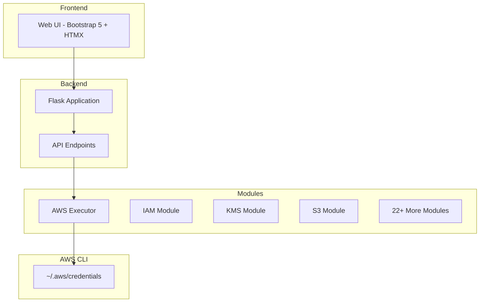

# IAMReaper - AWS Enumeration Tool

<p align="center">
  
  
  
</p>

## Overview

IAMReaper is a web application for automating AWS resource enumeration and security assessment. The project was developed with the assistance of an AI agent to streamline AWS enumeration tasks while maintaining a low level of abstraction—ensuring no details are lost during the process.

The tool was originally created to assist with the [ARTE](https://hacktricks-training.com/courses/arte/) AWS certification exam, eliminating the need to repeatedly execute the same enumeration commands manually.

## Features

### Core Capabilities
- **Web-based Interface**: Modern UI built with Bootstrap 5 and HTMX for reactive, seamless interactions
- **AWS CLI Integration**: Directly uses AWS CLI commands for reliable, low-level enumeration
- **Multi-profile Support**: Manage multiple AWS profiles and switch between them easily
- **Project Management**: Organize enumeration runs by project
- **Command History**: All executed commands are logged with detailed results
- **JSON Export**: Export enumeration results for further analysis
- **Multi-region Support**: Enumerate resources across multiple AWS regions

### Error Handling
- Automatic error classification (Access Denied, Throttling, Invalid Credentials, etc.)
- Detailed error messages and return codes
- Command timeout handling

### Supported AWS Services

| Service | Module | Description |
|---------|--------|-------------|
| IAM | [`modules/iam.py`](modules/iam.py) | Users, Groups, Roles, Policies, SAML Providers, MFA Devices |
| S3 | [`modules/s3.py`](modules/s3.py) | Buckets, ACLs, Policies, Encryption, Versioning |
| KMS | [`modules/kms.py`](modules/kms.py) | Keys, Policies, Grants, Custom Key Stores |
| EC2 | [`modules/ec2.py`](modules/ec2.py) | Instances, Security Groups, Volumes, Snapshots, VPCs |
| RDS | [`modules/rds.py`](modules/rds.py) | Databases, Snapshots, Subnet Groups |
| Lambda | [`modules/aws_lambda.py`](modules/aws_lambda.py) | Functions, Layers, Configurations |
| SNS | [`modules/sns.py`](modules/sns.py) | Topics, Subscriptions |
| SQS | [`modules/sqs.py`](modules/sqs.py) | Queues, Policies |
| ECR | [`modules/ecr.py`](modules/ecr.py) | Repositories, Images |
| ECS | [`modules/ecs.py`](modules/ecs.py) | Clusters, Services, Tasks |
| EFS | [`modules/efs.py`](modules/efs.py) | File Systems, Mount Targets |
| Secrets Manager | [`modules/secretsmanager.py`](modules/secretsmanager.py) | Secrets, Versions |
| SSM | [`modules/ssm.py`](modules/ssm.py) | Parameters, Documents, Instances |
| API Gateway | [`modules/apigateway.py`](modules/apigateway.py) | APIs, Stages, Authorizers |
| ELB | [`modules/elb.py`](modules/elb.py) | Load Balancers, Target Groups |
| CloudWatch Events | [`modules/eventbridge.py`](modules/eventbridge.py) | Rules, Targets |
| CodeBuild | [`modules/codebuild.py`](modules/codebuild.py) | Projects, Builds, Reports |
| Cognito | [`modules/cognito.py`](modules/cognito.py) | User Pools, Identity Pools |
| Beanstalk | [`modules/beanstalk.py`](modules/beanstalk.py) | Applications, Environments |
| DynamoDB | [`modules/dynamodb.py`](modules/dynamodb.py) | Tables, Backups |
| Step Functions | [`modules/stepfunctions.py`](modules/stepfunctions.py) | State Machines, Executions |
| Lightsail | [`modules/lightsail.py`](modules/lightsail.py) | Instances, Databases, Buckets |

## Architecture



## Prerequisites

- Python 3.8+
- AWS CLI configured with credentials
- Web browser (Chrome, Firefox, Edge, Safari)

## Installation

1. Clone the repository:
```bash
git clone https://github.com/yourusername/iamreaper.git
cd iamreaper
```

2. Install dependencies:
```bash
pip install -r requirements.txt
```

3. Configure AWS credentials:
```bash
aws configure
# Or manually edit ~/.aws/credentials
```

## Running the Application

1. Start the Flask server:
```bash
python3 app.py
```

2. Open your browser and navigate to:
```
http://localhost:5000
```

## Usage Guide

### Creating a Project
1. Click on "New Project" in the projects panel
2. Enter a project name and select an AWS profile
3. Choose the default AWS region
4. Click "Create" to save the project

### Running Enumeration
1. Select an active project from the dropdown
2. Choose a module from the modules panel (e.g., IAM, S3, EC2)
3. Click the "Run" button next to the module
4. View results in the results panel

### Exporting Results
1. After running a module, click "Export JSON" to download results
2. Results include all commands executed, their outputs, and metadata

## Configuration

### AWS Credentials
The application uses credentials from `~/.aws/credentials` as per standard AWS CLI configuration.

### Database
All projects, runs, and command results are stored in `iamreaper.db` (SQLite).

## Development

### Adding New Modules
To add support for a new AWS service, see [docs/modules_implementation.md](docs/modules_implementation.md).

### Project Structure
```
iamreaper/
├── app.py                  # Flask application entry point
├── modules/                # AWS enumeration modules
│   ├── base.py            # Base module class
│   ├── executor.py        # AWS CLI executor
│   ├── iam.py             # IAM module
│   └── ...                # Other service modules
├── database/              # Database schema and functions
│   ├── schema.py
│   └── db.py
├── templates/             # Jinja2 templates
│   ├── base.html
│   ├── index.html
│   └── components/
├── static/               # CSS and JavaScript
│   ├── css/
│   └── js/
└── docs/                 # Documentation
```

## License

This project is for educational and testing purposes. Use responsibly.

## Acknowledgments

- Developed with assistance from AI agents for the ARTE AWS certification
- Built using Flask, Bootstrap 5, and HTMX
