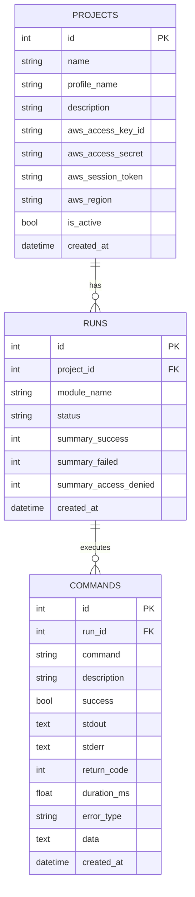

# Database - SQLite

## Description
Persistence system using SQLite to store projects, runs, and commands.

## File Structure

```
database/
├── __init__.py    # Initialization
├── schema.py      # Table schema
└── db.py          # CRUD functions
```

---

## Schema

### Table: projects

Stores AWS project configurations.

| Column | Type | Description |
|--------|------|-------------|
| id | INTEGER | Primary key |
| name | TEXT | Project name |
| profile_name | TEXT | AWS profile name |
| description | TEXT | Description |
| aws_access_key_id | TEXT | AWS Access Key |
| aws_access_secret | TEXT | AWS Secret Key |
| aws_session_token | TEXT | Session token (optional) |
| aws_region | TEXT | Default region |
| is_active | INTEGER | 1 if active |
| created_at | TEXT | Creation date |
| updated_at | TEXT | Update date |

### Table: runs

Stores module executions.

| Column | Type | Description |
|--------|------|-------------|
| id | INTEGER | Primary key |
| project_id | INTEGER | FK to projects |
| module_name | TEXT | Module name |
| status | TEXT | Status (running/completed/error) |
| summary_success | INTEGER | Successful commands |
| summary_failed | INTEGER | Failed commands |
| summary_access_denied | INTEGER | Access denied |
| created_at | TEXT | Execution date |

### Table: commands

Stores executed commands.

| Column | Type | Description |
|--------|------|-------------|
| id | INTEGER | Primary key |
| run_id | INTEGER | FK to runs |
| command | TEXT | Command executed |
| description | TEXT | Description |
| success | INTEGER | 1 if successful |
| stdout | TEXT | Standard output |
| stderr | TEXT | Standard error |
| return_code | INTEGER | Return code |
| duration_ms | REAL | Duration in ms |
| error_type | TEXT | Error type |
| data | TEXT | JSON with parsed data |
| created_at | TEXT | Timestamp |

---

## Main Functions

### [`init_db()`](database/schema.py:12)
Initializes the database and creates tables.

### Projects

#### [`create_project()`](database/db.py:25)
Creates a new project.

```python
def create_project(
    name: str,
    profile_name: str,
    description: str,
    aws_access_key_id: str,
    aws_access_secret: str,
    aws_region: str,
    aws_session_token: str = None
) -> int:
```

#### [`get_project(project_id)`](database/db.py:45)
Gets a project by ID.

#### [`get_all_projects()`](database/db.py:58)
Lists all projects.

#### [`get_project_by_name(name)`](database/db.py:72)
Searches project by name.

#### [`update_project()`](database/db.py:85)
Updates a project.

#### [`delete_project()`](database/db.py:115)
Deletes a project.

#### [`set_active_project(project_id)`](database/db.py:132)
Marks a project as active.

### Runs

#### [`create_run(project_id, module_name)`](database/db.py:150)
Creates a new run.

#### [`get_run(run_id)`](database/db.py:169)
Gets a run by ID.

#### [`get_runs_by_project(project_id)`](database/db.py:188)
Lists runs for a project.

#### [`update_run_summary()`](database/db.py:205)
Updates run summary.

### Commands

#### [`create_command()`](database/db.py:223)
Saves an executed command.

```python
def create_command(
    run_id: int,
    command: str,
    description: str,
    success: bool,
    stdout: str,
    stderr: str,
    return_code: int,
    duration_ms: float,
    error_type: str = None,
    data: Any = None
) -> int:
```

#### [`get_commands_by_run()`](database/db.py:261)
Lists commands for a run with filters.

#### [`get_command_count()`](database/db.py:291)
Counts commands with filters.

---

## Data Model



---

## See also

- [app.py](app.md) - Flask application
- [modules/modules.md](modules.md) - Enumeration modules
